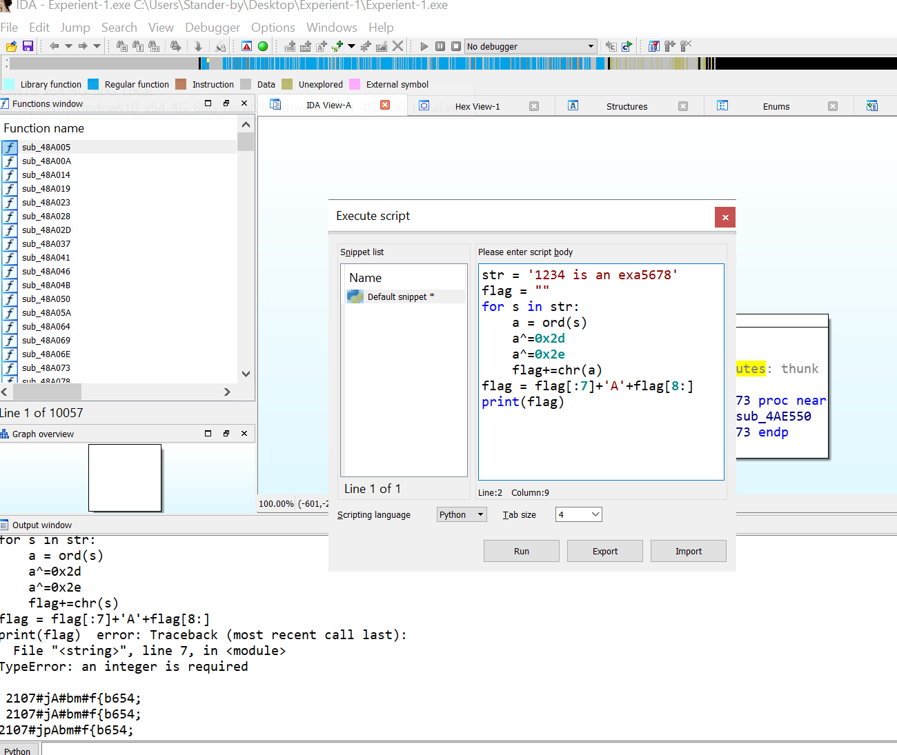
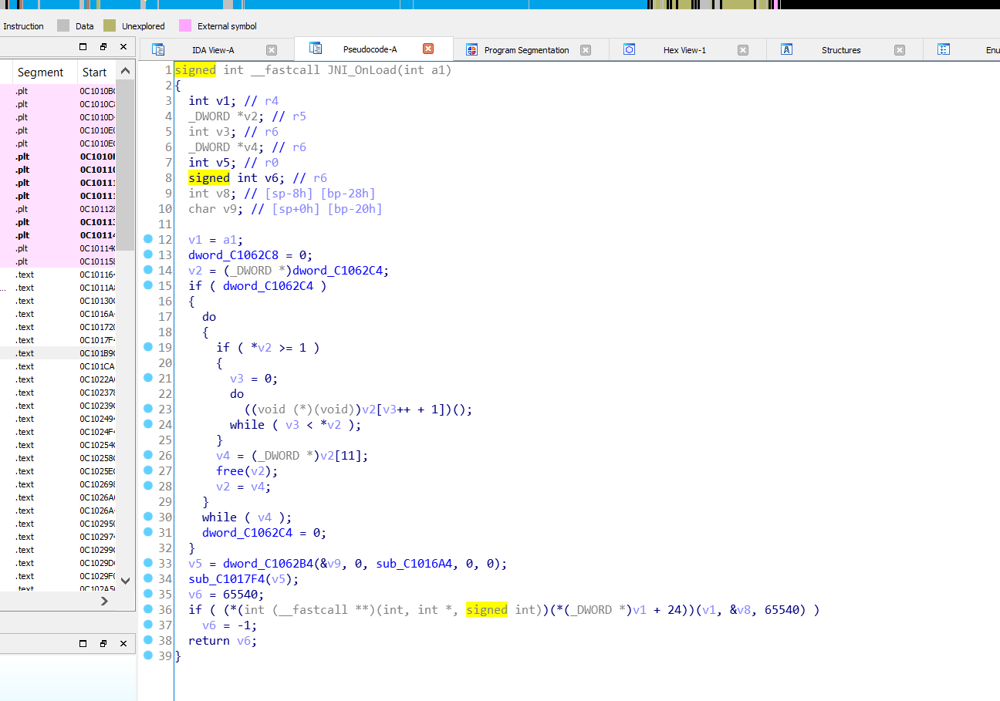
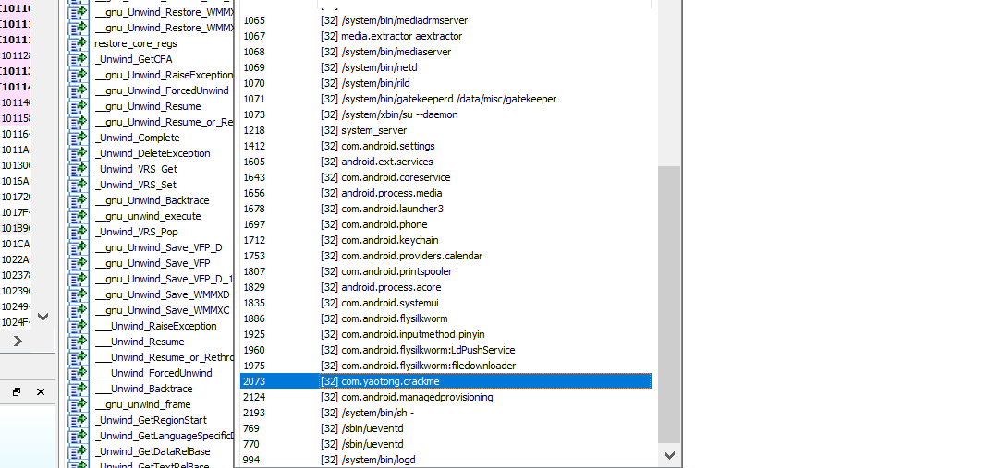

# 逆向工程分析技术

## Experiment-1
通过对"Please Input"字符串的查找，在汇编代码中找到关键变量dword_5F3088。

其中cmp eax，41h可以猜测到是把第八个字符换成A。

跟踪相关函数，反汇编，理解对字符串进行怎么样的操作，这里对每个字符都与0x2E进行亦或。

通过对dword_5F3088进行xref查找，得到对字符串修改的函数。

查找sub_49DC80 \<- sub_48DACA \<- sub_49CEB0()找到a1234isanexa。

编写脚本处理，得到结果如下flag为2107\#jpAbm\#f{b654;

反编译失败，修改相关指令。

## Experiment-2

先进行Android环境的配置，下载AndroidSDK并安装相应的安卓版本，创建安卓虚拟机，其中通过修改host文件来得到dl.google.com的资源。

将自毁程序在安卓模拟器中打开，注意Android要选用arm架构的，并且要安装相应的java环境，并打开moniter.bat进行进程的监听，打开自毁程序如图所示。

另外用AndroidKiller加载apk文件，打开AndroidManifest.xml找到程序的入口类com.yaotong.crackme.MainActivity。

通过jadx-gui分析源代码可以得到会调用securityCheck函数，该函数定义在libcrackme.so中。

用IDA分析libcrackme.so文件，并用c语言展示重要的几个函数，例如securityCheck ，jolin和JNI_OnLoad。

动态分析中，需要将android_server复制到对应目录，设置权限并运行，另开一个cmd进行端口映射，选择调试器，并attach相对应的进程，需要先在模拟器中运行apk。

观察到相应的进程，并加载进入到调试界面，发现程序加载停止到linker处，然后按照指导书设置断点进行调试，并设置相应的一些选项。

找到Modules模块中crackme的路径，点击进入具体位置。

调试到停留在24行断点处，观察off_C10628C显示其内容为aWojiushidaan，得到正确的flag。

输入flag。

## Experiment-3
首先利用ollydbg打开可执行文件Green.exe，右键选择查找中的“所有模块中的名称”，找到CreateFileA内置API

发现此时FileName参数指示了将要打开system.ini文件

System.ini文件是乱码，可能是解密该乱码

从断点处单步执行文件，并观察堆栈段情况，对比system.ini文件，发现首先将密文读入堆栈段

逐步执行语句，发现是逐步破解该密文

对应的地址发生改变

接下来对循环部分用高级语言解密

将185c70到185d00部分的16进制码存入一个数组里。

再写解密的过程的那个循环：

最后打印出来的内容和实际过程一样：

