# 跨站脚本攻击（XSS）实验

## 从受害者的机器上盗取 Cookie

首先以 Samy 的身份登录并打开个人简介进行编辑，在 Brief description 中添加如下脚本：

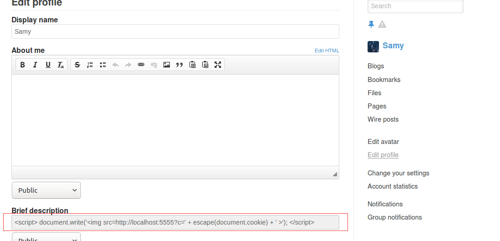

随后使用 Alice 账号登录，点击 Samy 主页并使用 nc -l 5555 -v 进行监听，观察到成功得到 Alice 的 cookie 信息，如下图

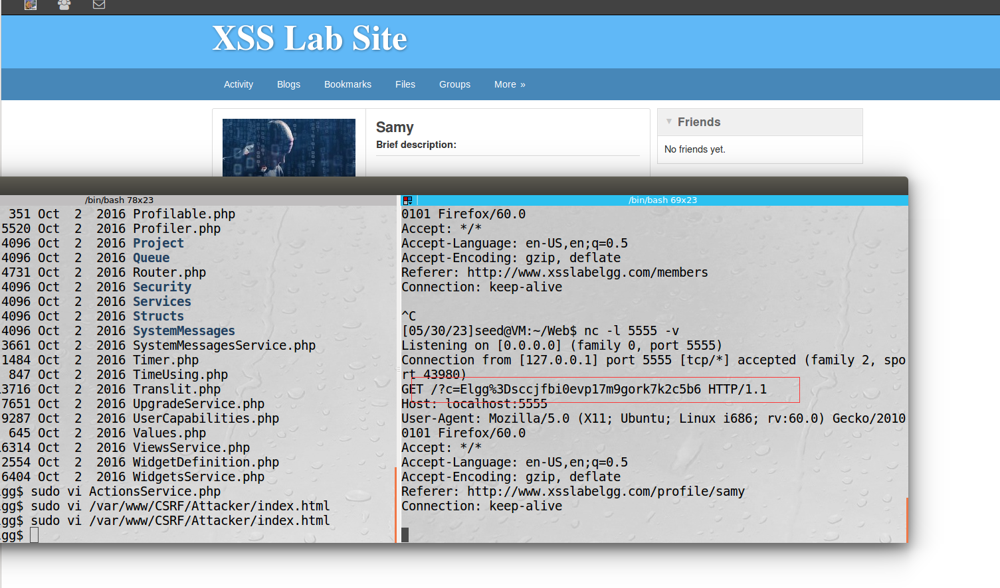

## 使用 Ajax 脚本自动发起会话劫持

在 Samy 的 about me 中添加攻击脚本如下

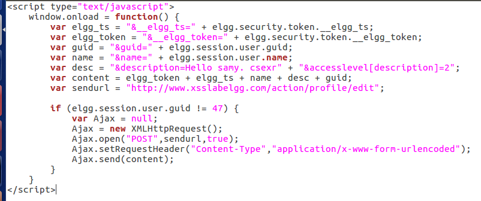选择edit html模式

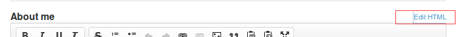

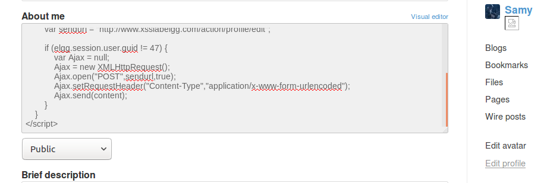

以 Alice 身份登录，点击 Samy 主页查看后使用 HTTPHeaderLive 抓取信息，观察到发起了修改个人简介的请求，如下图

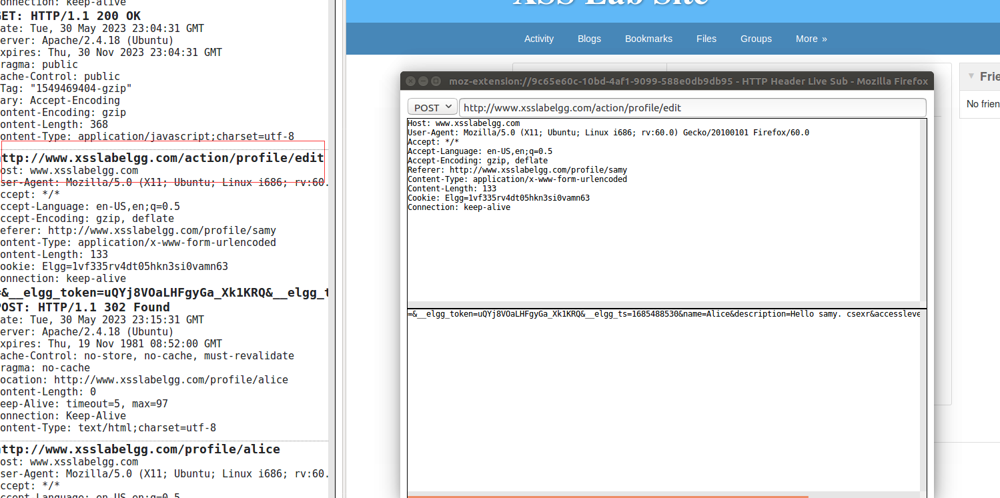

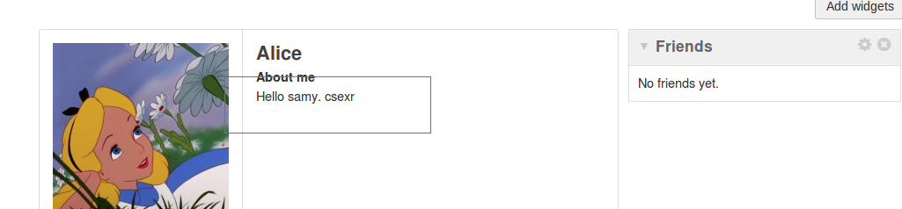

## 构造 XSS 蠕虫

修改任务 3 中的脚本使其产生复制作用，脚本如下

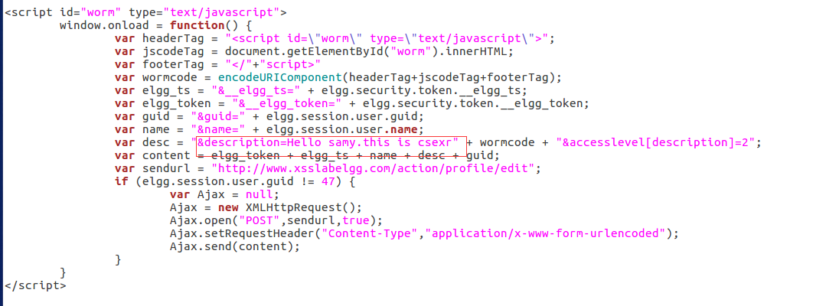

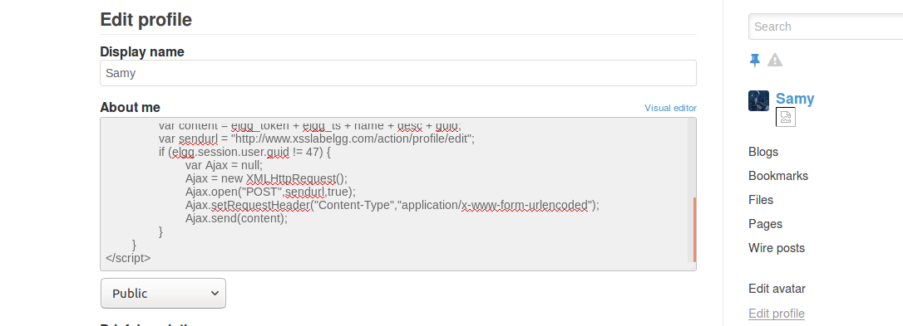

以 Alice 身份登录后点击 Samy 的主页进行查看，观察到成功发送 POST，如下图

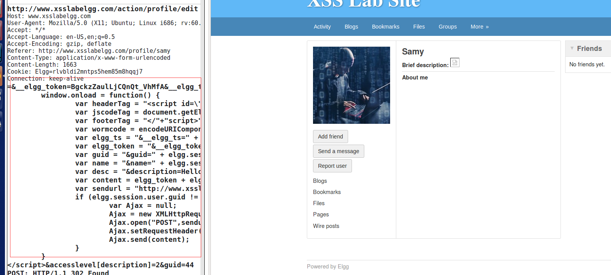

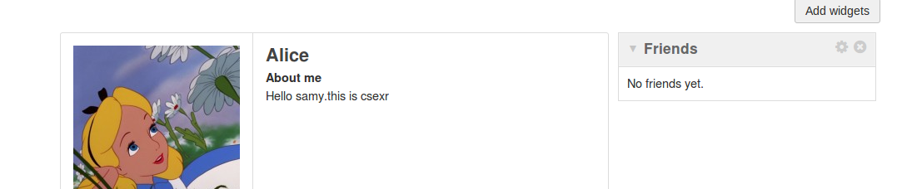

同时观察到Alice的about me也变为了蠕虫脚本，蠕虫病毒攻击成功。

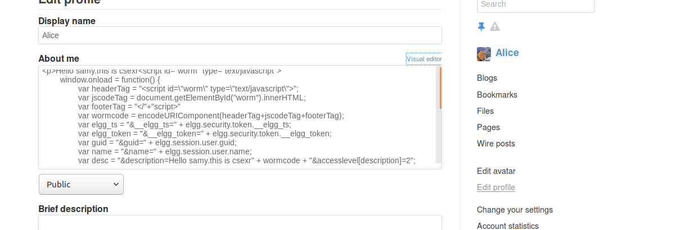

## 防御策略

以 admin 账号登录 Elgg 随后点击右上角的 Account 、administration 、plugins将该插件激活，点击 Activate，让其变为 Deactivate 如下

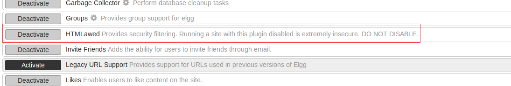

测试蠕虫病毒是否有效，观察到此时 JavaScript 脚本被解析为文本而非以脚本方式执行，如下图

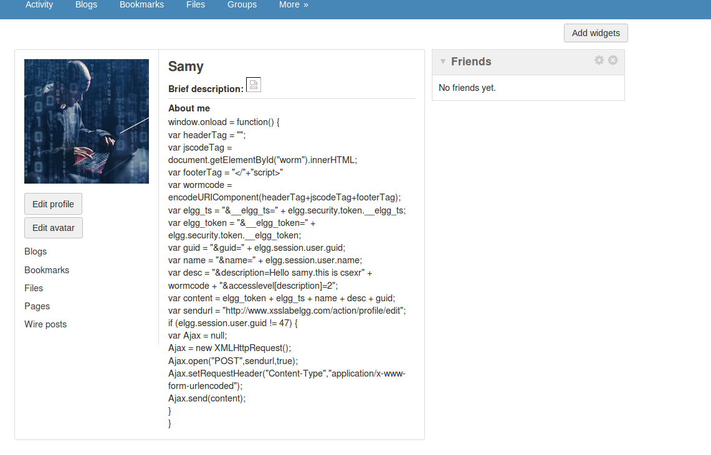

然后开启 htmlspecialchars

取消掉/var/www/XSS/Elgg/vendor/elgg/elgg/views/default/output目录下text.php 、url.php 、dropdown.php 、email.php 对 htmlspecialchars() 函数调用的注释

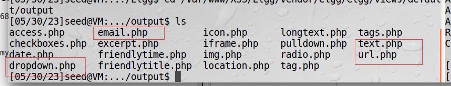

email.php

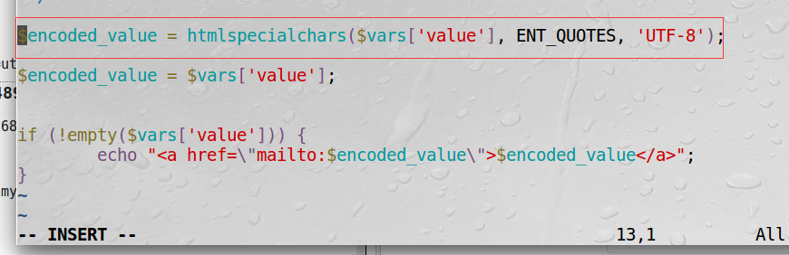

text.php

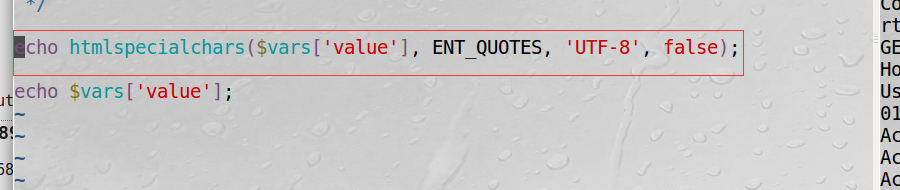

url.php

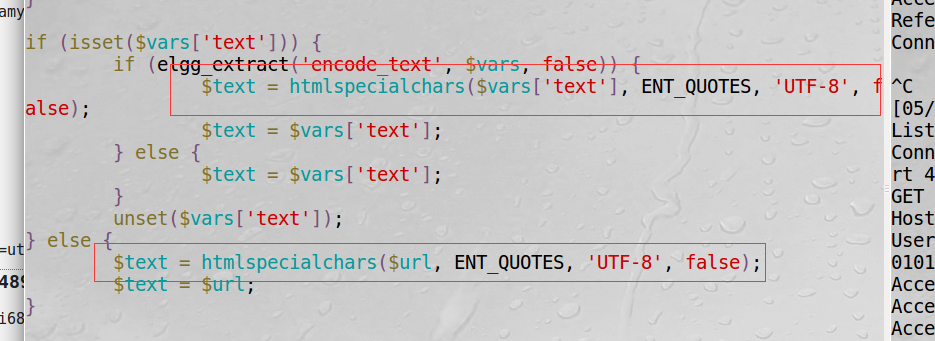

dropdown.php

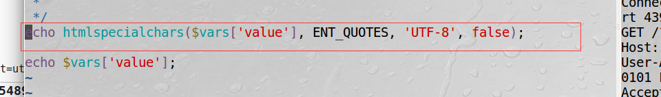

随后测试蠕虫病毒，登录Alice账号，然后编辑Alice简介，在about me处edit html,重新输入脚本,然后保存，再点开Alice的编辑简介，点edit html查看，观察到\>等字符被转义为了&lt等内容，如下

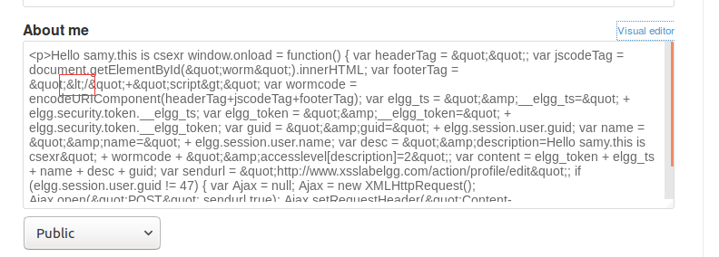
